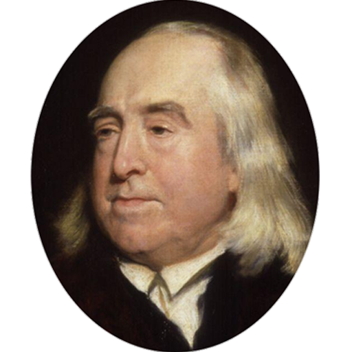

# 

## What is it?

A simple Alexa skill to reveal timetable for UCL students. Simply say "Alexa, open myUCL"!


## Install Guide

### Prerequisites
 1. You need an amazon AWS account with some credit (students recieve $100 for free with [AWS educate])(https://aws.amazon.com/education/awseducate/apply/)
 2. You need an Alexa Echo/Dot or have the ability to test [some other way](https://www.raspberrypi.org/blog/amazon-echo-homebrew-version/). 
 3. You need to have signed up for [Alexa skills kit](https://developer.amazon.com/edw/home.html#/) on the Developer link
 3. You need to locate your UCL ICS academic calender link. To do this: 
  i. Log into your [timetable](https://timetable.ucl.ac.uk/tt/homePage.do) with your UCL username and password.
  ii. Click on the subcribe link on the top RHS of the calender:
  [subscribe](img/subscribe.png)
  iii. Copy and paste the URL given and save it, you'll need it later.
  [url](img/url.png)
  * note- this should work for any ICS calender or any universtiy, not just UCL.*

### Setup 
 1. Let's make a new directory to put everything in. You can rename this or put in whatever directory you like but for the rest of the tutorial we will use this.
```
mkdir ~/myUCL
```
 2. We need a virtual environment for our Python folder to go in- let's install it. (* note - this is especially important in this tutorial because later we use Zappa to configure the automatic upload to AWS lambda)
```
pip install virtualenv
```
 3. Now we need to create the virtual environment:
```
virtualenv ~/myUCL/py27
```
 4. We must activate this virtual environment so this new python folder is being used. As this command is run you'll notice the virtual environment name, in this case py27 will proceed the bash symbol.
```
source ~/myUCL/bin/activate
```
 5. We are now ready to install the libaries with PIP
```
pip install flask flask-ask unidecode ics zappa awscli
```
 6. Let's clone the github repo (don't forget the dot)
```
cd ~/myUCL; clone https://github.com/rmsmith88/myUCL.git .
```
 7. Copy the example json config file found in configs folder and create a new file. Name the new file `config.json`. If you open this file you need to paste in the UCL ICS ID that you found earlier as a prereq. Please remove the `webcal://` part and have it in the same format as the example.
 
 8. It's a simple FLASK server so let's run it and see that it works:
 ```
 python run.py
 
 python run.py 
 * Running on http://127.0.0.1:5000/ (Press CTRL+C to quit)
 * Restarting with stat
 * Debugger is active!
 * Debugger pin code: 142-139-224

 ```
 Ok great, we can cancel that by pressing CTRL+C
 

### Setting up AWSCLI & Zappa
[](https://www.youtube.com/watch?v=mjWV4R2P4ks)


TODO DELETE ~/MYUCL

#### Option2 - test locally using NGROK instead of Zappa 

Remember that step earlier where we ran the run.py file to check that everything was working? We can use NGROK to route that local server so that Alexa can use it (this is instead of AWS Lambda)

 1. download https://ngrok.com/download
 2. Put ngrok in the directory of your app
 3. Make sure that FLASK server is running again, `python run.py`
 4. Run ngrok with `ngrok http 5000`
 5. It will give you the url that can be accessed externally e.g. 
 `http://66c8dd9b.ngrok.io`  
 You can put this as your end point on the AWS page.


## Todo
 1. Add functionality (deadlines, command multiple weeks, date queries etc)
 2. Save cal to disk rather than mutliple 
 3. TBC